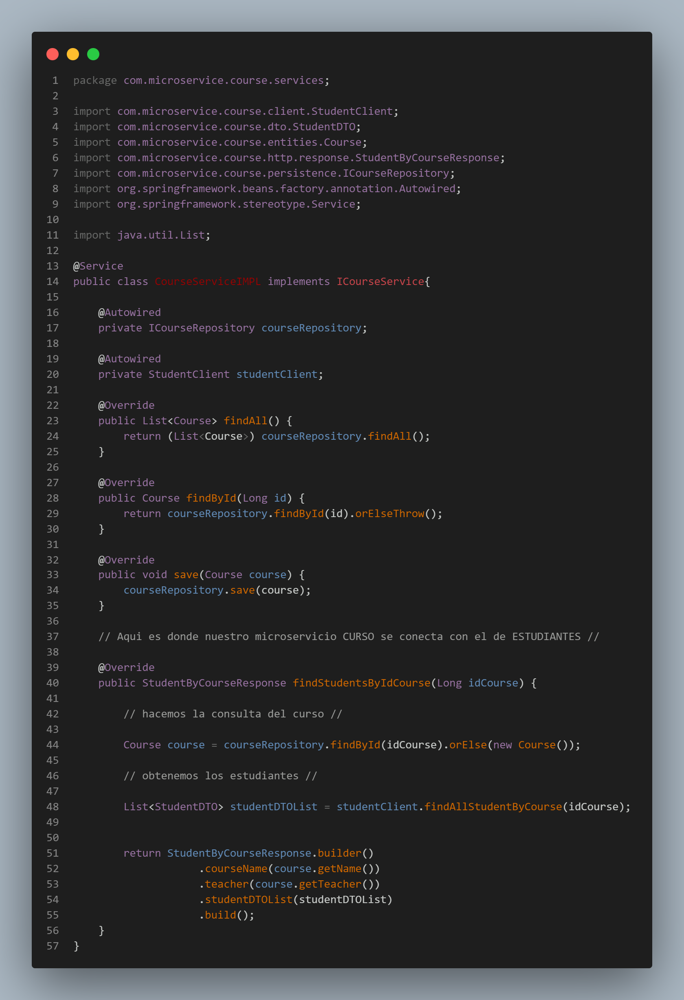
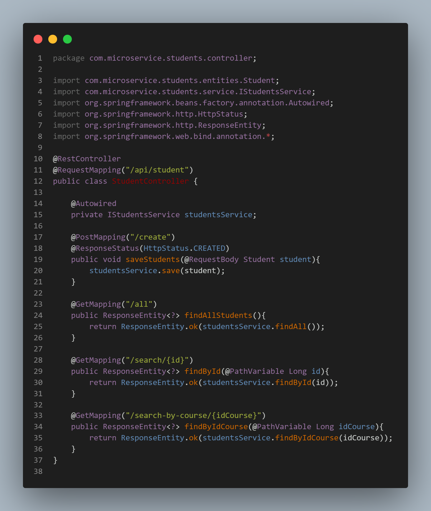
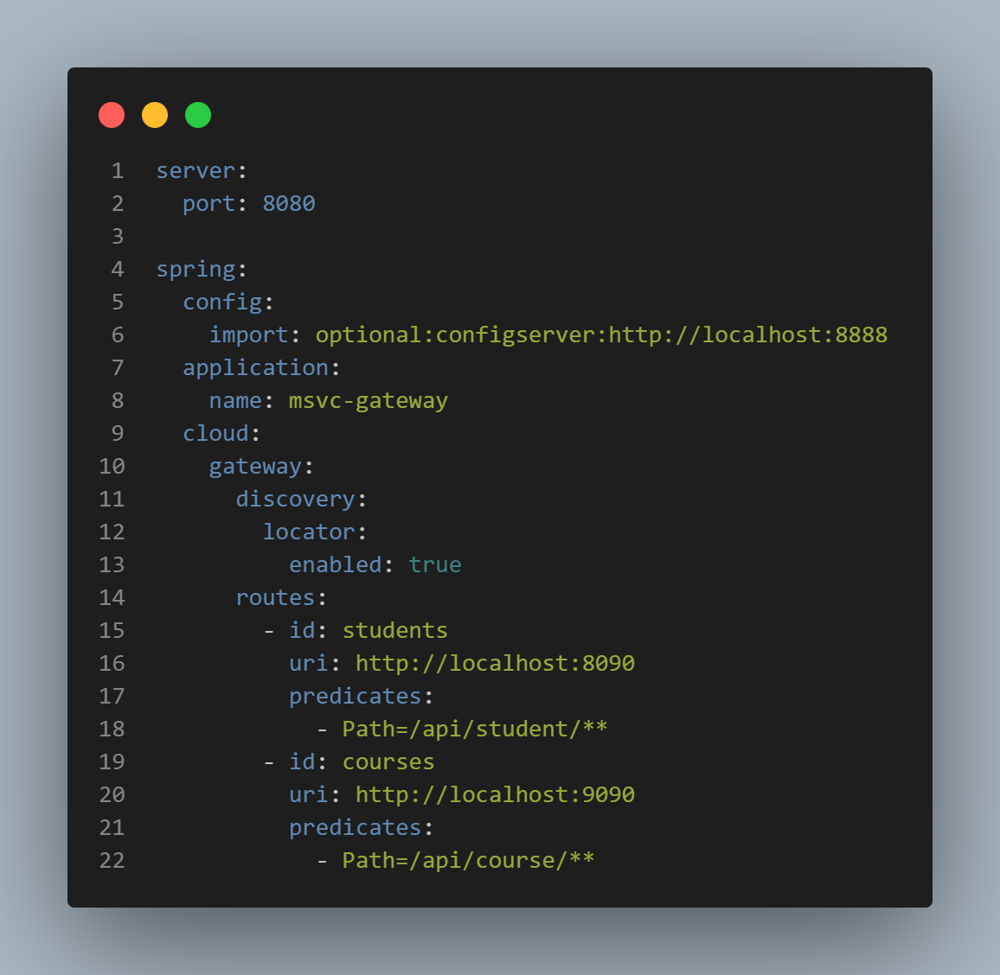
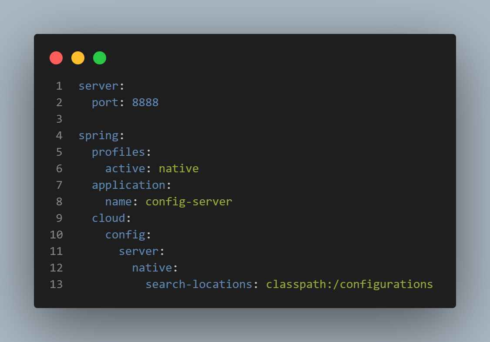

## Microservices- Springboot

## El gateway es nuestro servicio de entrada a la aplicacion, aqui, estan configurados las puertas o enlaces de nuestro servicio de COURSES y STUDENTS ,tambien podremos integrar nuestra capa de seguridad para evitar intrusiones en el sistema.

## Aqui es donde vamos a guardar toda la configuracion relacionada a los microservicios, en la carpeta "configurations" en archivos .yml

